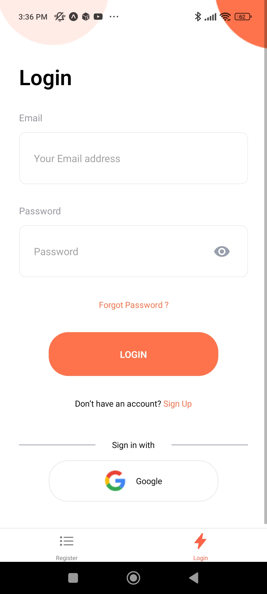
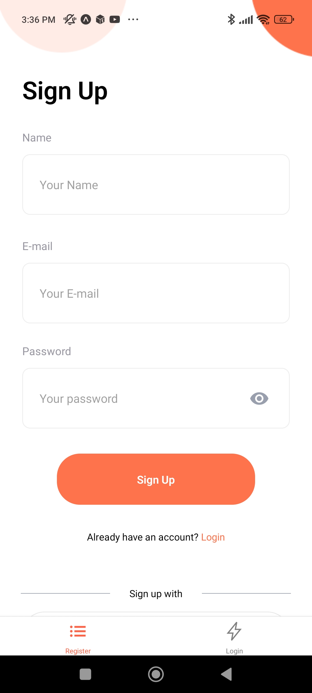
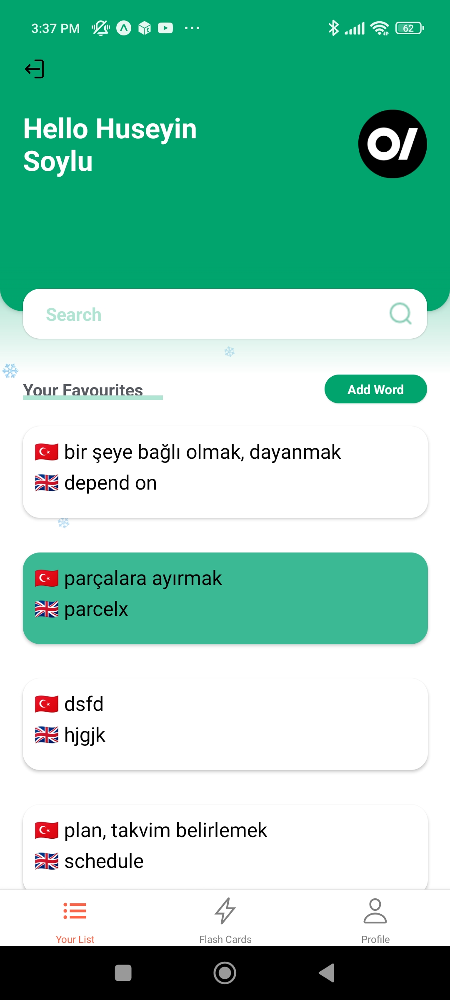
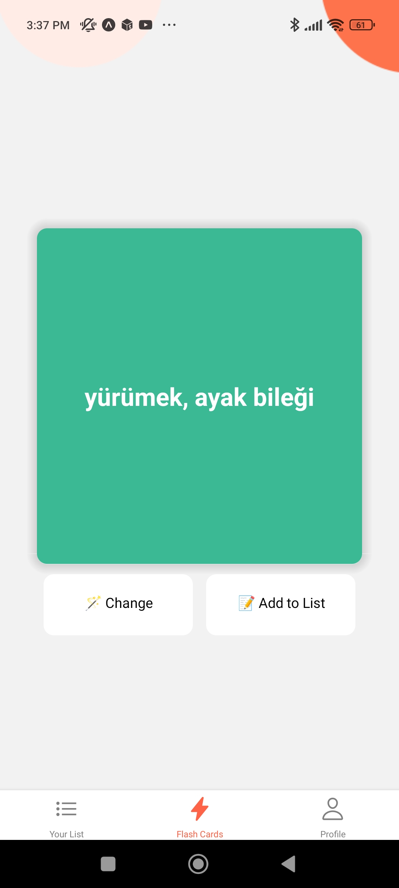
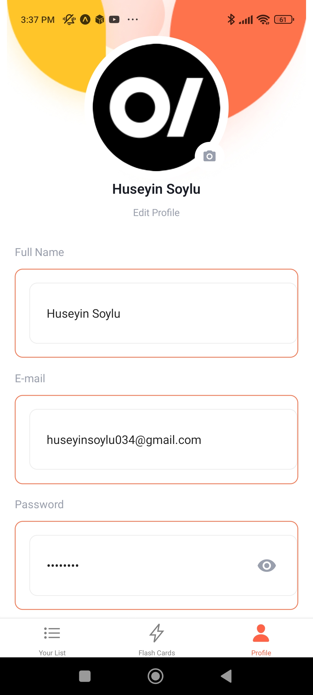
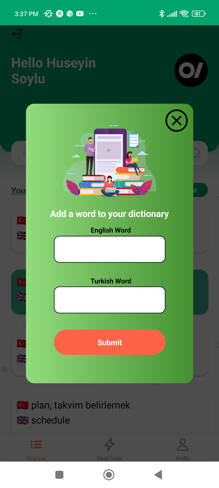
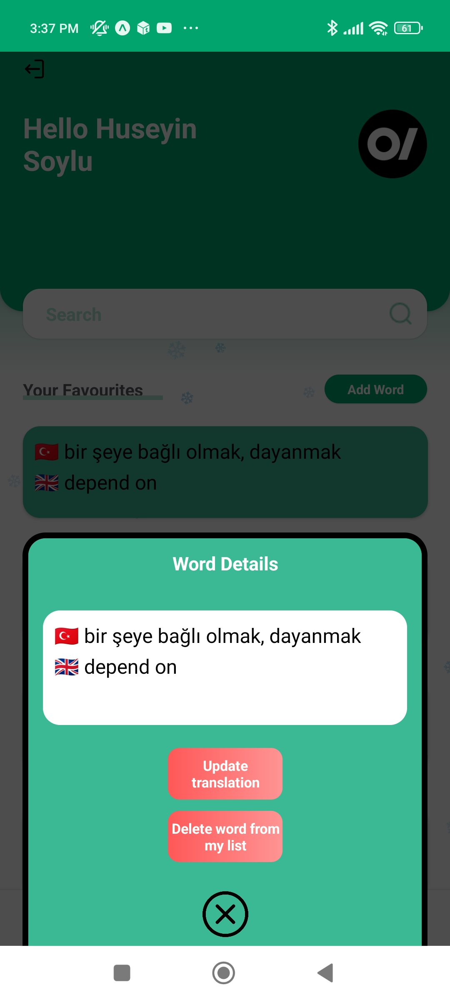
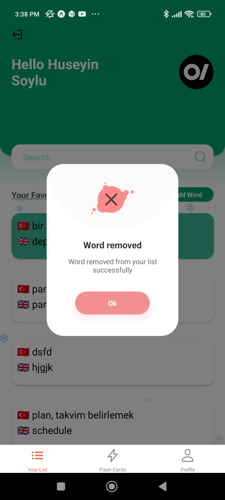

# Personal_Dict

### personal dictionary app with React Native / Expo

    This project is my first projects using React Native, so I tried a lot of library,
    It might seem a bit confusing as I don't delete repos I don't use.
    I'm thinking of updating the folder structure of the project when I get the chance.
    I also plan to fix the code, using ESLint on next update.

## Project Features

- React Navigation
- React Native Firebase , Authentication, Firestore
- React Native Config
- Expo Font, Icons
- Formik , Yup
- Popup UI
- React Native Gestures
- React Native Modal, Reanimated
- React Native Gradient, Svg
- Flip Card
- Lottie React Native
- React Native Flash Message

# Installation

1. Install [node.js](https://nodejs.org/en/)
2. Install Expo

   ```jsx
   npm install --global expo-cli
   ```

3. Clone this repo
4. Install deps on your template folder

   ```jsx
   npm install
   ```

   if you get error here, you can use the `legacy-peer-deps` as parameter

   ```jsx
   npm install --legacy-peer-deps
   ```

5. Start the environtment

   ```jsx
   expo start
   ```

   or

   ```jsx
   npx expo start
   ```

# Auth Flow

### Firebase Setup

- Set up a new firebase project
- Go to Authentication and under Sign-in Method enable Email/Password
- Go to Firestore and Create Database with production mode
- Go to your Database rules and configure permissions (remove `: if false` in line 5)
- Fill this firebase config to your config inside `./src/Firebase.js`

```jsx
// You can use .env in here
const firebaseConfig = {
  apiKey: "",
  authDomain: "",
  databaseURL: "",
  projectId: "",
  storageBucket: "",
  messagingSenderId: "",
  appId: "",
};
```

and you good to go!

## Screens

| Login                                                         | Register                                                         | Home Screen                                                  |
| ------------------------------------------------------------- | ---------------------------------------------------------------- | ------------------------------------------------------------ |
|  |  |  |

| Flash Cards                                                       | Profile                                                         | Add Word Modal                                                       |
| ----------------------------------------------------------------- | --------------------------------------------------------------- | -------------------------------------------------------------------- |
|  |  |  |

| Word Details Modal                                                   | Update Word Modal                                                                                            | Delete Word Flash                                                   |
| -------------------------------------------------------------------- | ------------------------------------------------------------------------------------------------------------ | ------------------------------------------------------------------- |
|  |  |  |
